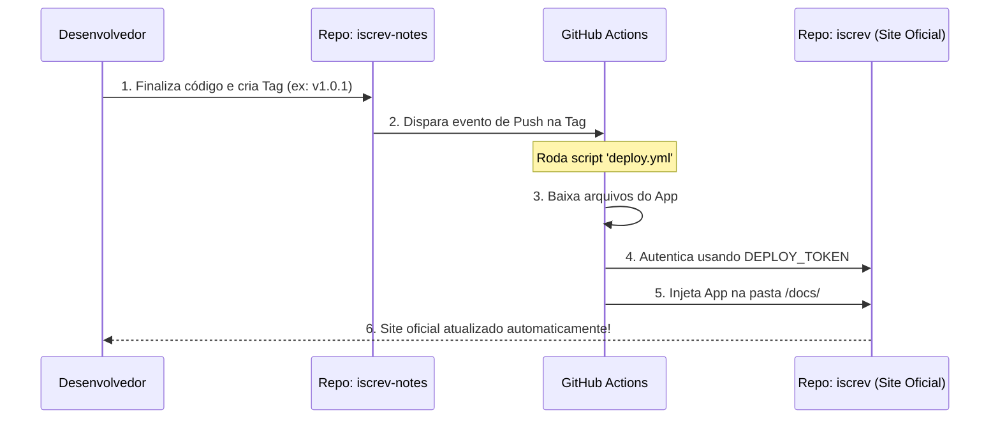

# Workflow de Integração e Entrega Contínua (CI/CD) - iScrev Notes

Este documento detalha o processo de arquitetura de implantação (deploy) automatizada do aplicativo **iScrev Notes**. O projeto utiliza o **GitHub Actions** para garantir que as atualizações do código-fonte sejam injetadas com segurança na hospedagem do site oficial (o repositório institucional) de forma completamente autônoma.

---

## 1. Arquitetura do Sistema

Para manter a separação de responsabilidades (Separation of Concerns), o ecossistema iScrev foi dividido em dois repositórios:

1. **Repositório de Hospedagem e Marketing (`iscrev`)**: Contém as páginas institucionais, o blog estático, e o diretório `/docs`, que é de onde o GitHub Pages serve o site na internet.
2. **Repositório do Aplicativo (`iscrev-notes`)**: Contém exclusivamente o código-fonte (HTML/CSS/JS) do aplicativo iScrev Notes.

### Diagrama de Fluxo de Deploy



---

## 2. Pré-requisitos e Estrutura Local

Para que a automação funcione sem quebrar o site institucional, o repositório `iscrev-notes` deve ser mantido limpo.

*   A pasta `src/` deve conter apenas arquivos relativos ao aplicativo. **Não devem ser colocados aqui** arquivos como `index.html` institucional ou o `style.css` do site principal.
*   O arquivo `service-worker.js` deve armazenar em cache apenas caminhos relativos aos recursos do próprio app (ex: `./diario.html`, `./assets/css/diario.css`), caso contrário, gerará erros 404 na navegação offline.
*   O arquivo de instruções para o robô deve existir exatamente no caminho: `.github/workflows/deploy.yml`.

---

## 3. Configurações de Segurança no GitHub

A parte mais sensível da operação é permitir que um repositório escreva dados em outro. Para isso, utilizamos o **Fine-grained Personal Access Token** — um formato de token altamente restrito.

### 3.1. Gerando o Token no GitHub
O token é a "chave da porta".

1. Acesse o [GitHub Developer Settings](https://github.com/settings/tokens?type=beta).
2. Clique em **Generate new token**.
3. **Token Name**: Nomeie-o (Ex: `iscrev-deploy-action`).
4. **Expiration**: Defina a validade (Tokens com validade protegem o projeto caso vazem).
5. **Repository Access**: Selecione **Only select repositories** e escolha apenas o repositório institucional (`iscrev`). *Isso garante que, em caso de falha, o robô não tenha acesso a nenhum outro projeto seu.*
6. **Permissions > Repository permissions**:
   - Vá até **Contents** e defina o nível de acesso para **Read and write**.
7. Gere o token e **copie o código** gerado (começa com `github_pat_...`).

> [!CAUTION]
> Nunca comite esse token no código-fonte nem o envie por meios inseguros. Ele é uma credencial direta para alterar o seu site oficial.

### 3.2. Armazenando o Secret no Repositório do App
O robô precisa saber dessa chave, mas ela deve ficar escondida.

1. Vá para a página do repositório **`iscrev-notes`** no GitHub.
2. Clique na aba **Settings** > **Secrets and variables** > **Actions**.
3. Clique em **New repository secret**.
4. **Name**: `DEPLOY_TOKEN` *(deve ser escrito exatamente desta forma em letras maiúsculas)*.
5. **Secret**: Cole o seu código `github_pat_...`.
6. Salve.

---

## 4. Como Atualizar o App na Prática

Sempre que você finalizar o desenvolvimento de uma nova funcionalidade (feature) ou correção de bugs e o aplicativo estiver pronto para o lançamento, siga o passo a passo:

### Passo Único: Versionamento com Tags

O robô (`deploy.yml`) está programado para ser ativado **apenas quando o GitHub detectar a chegada de uma "Tag"** de versão (começando com a letra 'v'). 

Isso significa que você pode fazer quantos commits "quebrados" ou incompletos desejar (ex: `git push origin main`), e o site oficial **não será afetado**.

Quando o projeto estiver perfeito e polido localmente, lance a versão assim:

```bash
# 1. Comite suas mudanças locais normalmente
git add .
git commit -m "feat: Adicionado modo noturno"
git push origin main

# 2. Crie uma "etiqueta" (Tag) apontando para a nova versão
git tag v1.0.1

# 3. Envie a etiqueta para o servidor. 
# -> É ESTE COMANDO QUE ACIONA A ATUALIZAÇÃO DO SITE <-
git push origin v1.0.1
```

### Validação
Após o `git push origin v1.0.1`, você pode acessar a aba **Actions** na página do `iscrev-notes` no GitHub. Lá, você verá o robô trabalhando ao vivo. Em cerca de 15 segundos, o ícone ficará verde (✅) e o seu site hospedado já estará rodando a nova versão do iScrev Notes.
